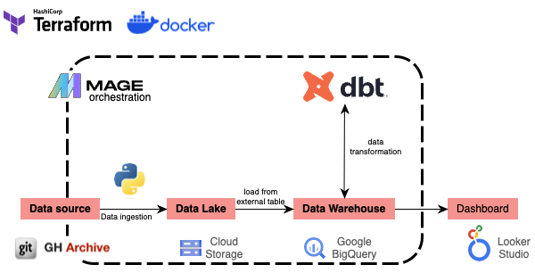
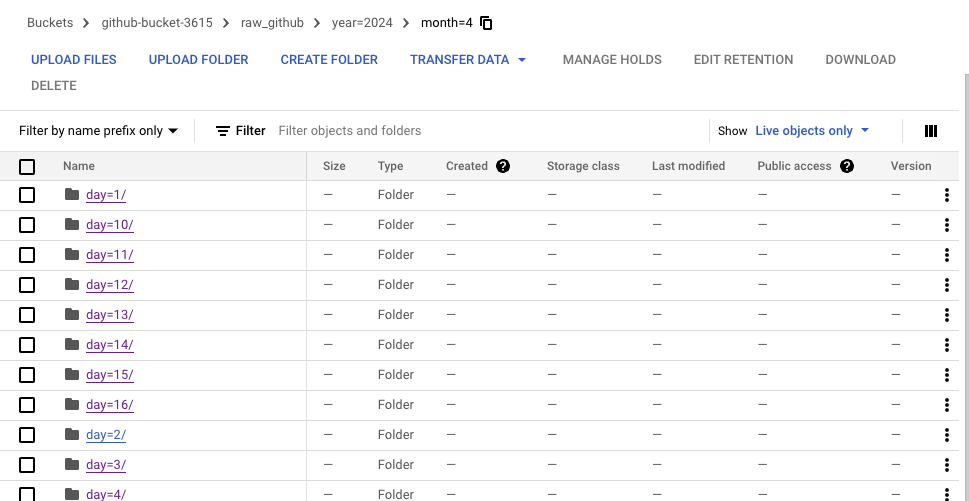
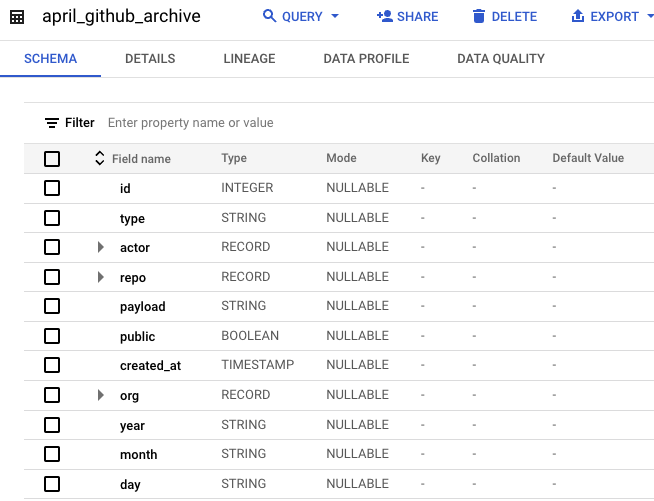
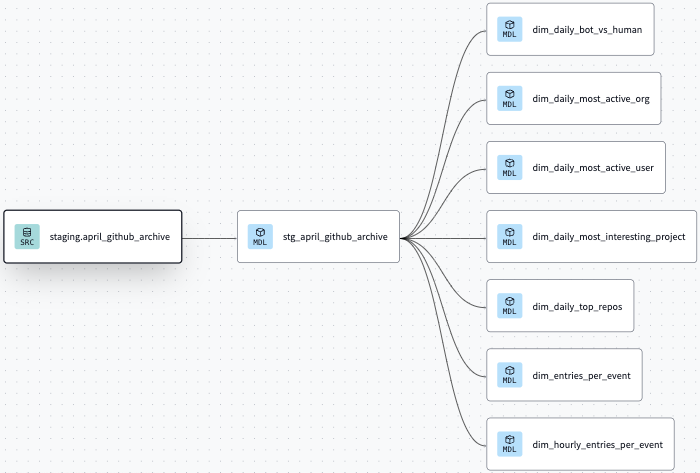
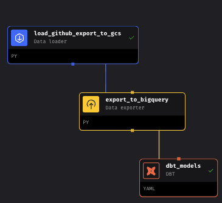
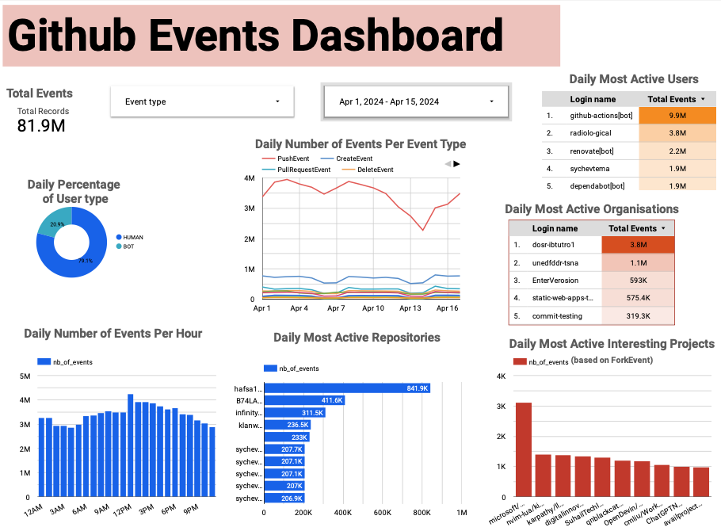

# Github Event Pipeline

## Table of contents

- [Project Description](#Project-description)
- [Technologies](#Technologies)
- [Data Pipeline Architecture](#data-pipeline-architecture)
    - [(1) Ingest github archive to Google Cloud Storage (GCS) ](#1-Ingest-github-archive-to-google-cloud-storage)
    - [(2) Load data from GCS to BigQuery](#2-Load-data-to-BigQuery)
    - [(3) Dbt Data transformation ](#3-Dbt-data-transformation)
    - [(4) Mage Orchestration](#4-Mage-orchestration)
    - [(5) Data Visualization with Looker](#5-Data-visualization-with-looker)
- [Reproducibility](#reproducibility)
    - [Data lake and Data Warehouse setup](#Data-lake-and-Data-Warehouse-setup)
    - [1- Mage Local Setup](#1-Mage-local-setup)
    - [2- Mage Cloud Setup](#2-Mage-cloud-setup)
- [Further Improvements](#further-improvements)


## Project description
This project to build a pipeline for Batch data processing. I use a dataset from [Github archive](https://gharchive.org/). This datset is updated each hour and store several github user activities.

In this project, i will use some data engineering practices to discover some trends such as:
* Number of activities per event type (on daily basis)
* Repositories with top activities (on daily basis)
* Most active users
* Most active organizations
* Most interesting projects (based on how many times a repository is Forked)
* Daily percent of human user vs Bot user (per event type)
## Technologies
In this project, i use:
* Google Cloud Storage (GCS) as Data Lake
* Google BigQuery as Data Warehouse
* Terraform as Infrastructure as code (IaC)
* Mage for Workflow Orchestration and Batch processing. I provide:
    *  a local version which run with docker and
    * Cloud version which run on Google Cloud Plateform (GCP)
* 

## Data Pipeline Architecture


The data pipeline is as follow:
1. Ingest data from  [Github archive](https://gharchive.org/) to Google Cloud Storage

2. Load data to BigQuery

3. Transform data with Dbt

4. Orchestrate evrything with Mage

5. visualize with looker studio

## 1 Ingest github archive to Google Cloud Storage
I ingest the data from the beginning of April 2024. For the first run, the program check if there is a data in the bucket for two days before the running time and then load the data from the beginning of april 2024. Each new run will only ingest the data of the previous day. The data are partitioned by `year`, `month`, and `day`. 



## 2 Load data to BigQuery
I write a custom code for the creation of external table in Bigquery.  It checks if it's an initial run and load all the partionned data to bigquery. If it's the daily run, he will just load the data of the previous day (the last ingested in GCS).  


## 3 Dbt data transformation

For Dbt transformation, i build first a staging model `stg_april_github_archive` that clean redundant data and partition the data by day and cluster by day and event type. I built after that all other models. The materialization used is `incremental`and allow to transform the newly available data and merge it with the older one.




## 4 Mage orchestration

All the process is run in Mage with a daily schedule. We use environment variables to store the infrastructure parameter (GCS bucket, Biguery table, Bigquery dataset, google Credentials).

For the local run, the environment variables are written in `.env` file and is loaded to the system. For the cloud run, the variables is defined in Terraform.

## 5 Data visualization with looker studio


Here is the link to the [Dashboard](https://lookerstudio.google.com/reporting/776c1178-bfd7-48b6-b7fb-8218bfc04063)

## Reproducibility

Clone the project `https://github.com/lvsuno/Github_data_analysis.git`

For this project, we'll use a free version (upto EUR 300 credits). 

1. Create an account with your Google email ID 
2. Setup your  [project](https://console.cloud.google.com/) if you haven't already
    * eg. "Github-data-analysis", and note down the "Project ID" (i'll use this later when deploying infra with TF)

3. Enable these APIs for your project:
   * https://console.cloud.google.com/apis/library/iam.googleapis.com
   * https://console.cloud.google.com/apis/library/iamcredentials.googleapis.com
   * https://console.cloud.google.com/apis/api/bigquery.googleapis.com/

4. Setup [service account & authentication](https://cloud.google.com/docs/authentication/getting-started) for this project
    * Grant `Owner` role.
    * Download service-account-keys (.json) for auth.
    * Create a folder named `.keys` in the main folder of the project you've downloaded
5. Download [SDK](https://cloud.google.com/sdk/docs/quickstart) for local setup


6. Set environment variable to point to your downloaded GCP keys:
   ```shell
   export GOOGLE_APPLICATION_CREDENTIALS="<path/to/your/service-account-authkeys>.json"

   # gcloud init to set up gcloud
   
   # Refresh token/session, and verify authentication
   gcloud auth application-default login
   ```

### Data lake and Data warehouse setup
In GCP : 
1. [IAM Roles](https://cloud.google.com/storage/docs/access-control/iam-roles) for Service account:
   * Go to the *IAM* section of *IAM & Admin* https://console.cloud.google.com/iam-admin/iam
   * Click the *Edit principal* icon for your service account.
   * Add these roles in addition to *Viewer* : **Storage Admin** + **Storage Object Admin** + **BigQuery Admin**

Install Terraform and change the name of your variables in the file `infrastructure/gcs+bigquery/variables.tf`. 


From the main folder of the project run the following command:

```
terraform -chdir=./infrastructure/gcs+bigquery init

terraform -chdir=./infrastructure/gcs+bigquery  apply
```

### 1 Mage local setup
After installing docker, run `docker compose up` from the main folder of the project. Go to `http://localhost:6789/` and you should see the pipeline named `github_etl`.
### 2 Mage cloud setup
For the cloud deployment of Mage, Go to GCP and 

1.  Create a service account and Grant the following roles to a new service (BigQuery Admin, Cloud SQL Admin, Owner, Storage Admin, Storage Object Admin, Cloud Run Admin, Artifact Registry Reader, Artifact Registry Writer, Serverless VPC Access Admin, Service Account Token Creator, Secret Manager Secret Accessor)

2. Enable these APIs for your project:
   * https://console.cloud.google.com/apis/library/iam.googleapis.com
   * https://console.cloud.google.com/apis/library/iamcredentials.googleapis.com
   * https://console.cloud.google.com/apis/api/bigquery.googleapis.com/
   *  For terraform deployment
      * https://console.cloud.google.com/apis/library/artifactregistry.googleapis.com
      * https://console.cloud.google.com/apis/library/cloudresourcemanager.googleapis.com
      * https://console.cloud.google.com/apis/library/vpcaccess.googleapis.com
      * https://console.cloud.google.com/apis/library/secretmanager.googleapis.com
      * https://console.cloud.google.com/apis/library/sqladmin.googleapis.com
      * https://console.cloud.google.com/apis/library/file.googleapis.com
      * https://console.cloud.google.com/apis/library/serviceusage.googleapis.com

3. Setup secrets for Mage by following this tuto https://docs.mage.ai/production/deploying-to-cloud/gcp/setup#secrets . Keep the following name for your secrets setting `bigquery_credentials`.

4. In the main folder of the project run the following code

```
terraform -chdir=./infrastructure/deploy_mage init

terraform -chdir=./infrastructure/deploy_mage apply
```
>Note: It's important to go the folder `infrastructure/deploy_mage/` and change the variable names according to your bucket name, bigquery dataset, bigquery table, project-id,  

## Further improvements
CI/CD : Integration


